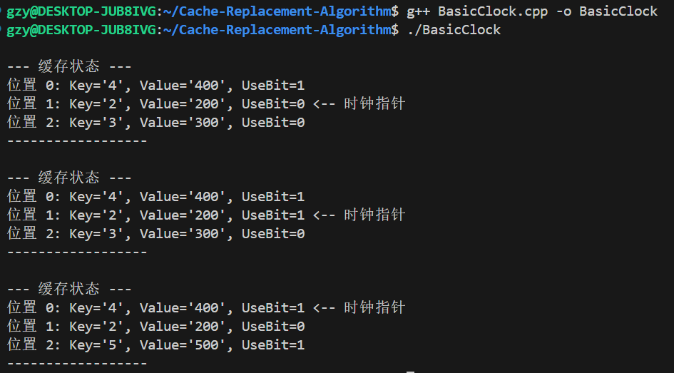

```C++
#include <iostream>
#include <vector>
#include <optional>

// 缓存项的结构体
struct CacheItem
{
    int key;
    int value;
    int use_bit;
};

class BasicClock
{
private:
    std::vector<std::optional<CacheItem>> cache_;
    int capacity_;
    int hand_; // 时钟指针

public:
    BasicClock(int capacity) : capacity_(capacity), hand_(0)
    {
        cache_.resize(capacity_);
    }

    std::optional<int> get(int key)
    {
        for (auto &it : cache_)
        {
            if (it.has_value() && it.value().key == key)
            {
                it.value().use_bit = 1;
                return it.value().value;
            }
        }
        return std::nullopt;
    }

    void put(int key, int value)
    {
        for (auto &it : cache_)
        {
            if (it.has_value() && it.value().key == key)
            {
                it.value().value = value;
                it.value().use_bit = 1;
                return;
            }
        }

        // 键不存在，准备替换
        while (true)
        {
            // 获取当前时钟指针指向的缓存项
            auto &current_it = cache_[hand_];

            if (!current_it.has_value())
            {
                // 当前位置为空，直接插入
                current_it = CacheItem{key, value, 1};
                hand_ = (hand_ + 1) % capacity_;
                return;
            }

            if (current_it.value().use_bit == 0)
            {
                current_it = CacheItem{key, value, 1};
                hand_ = (hand_ + 1) % capacity_;
                return;
            }

            if (current_it.value().use_bit == 1)
            {
                current_it.value().use_bit = 0;
                hand_ = (hand_ + 1) % capacity_;
            }
        }
    }

    void display() const
    {
        std::cout << "\n--- 缓存状态 ---" << std::endl;
        for (int i = 0; i < capacity_; ++i)
        {
            if (cache_[i].has_value())
            {
                std::cout << "位置 " << i << ": Key='" << cache_[i].value().key
                          << "', Value='" << cache_[i].value().value
                          << "', UseBit=" << cache_[i].value().use_bit;
            }
            else
            {
                std::cout << "位置 " << i << ": 空";
            }
            if (i == hand_)
            {
                std::cout << " <-- 时钟指针";
            }
            std::cout << std::endl;
        }
        std::cout << "------------------" << std::endl;
    }
};

int main()
{
    BasicClock cache_clock(3);

    cache_clock.put(1, 100);
    cache_clock.put(2, 200);
    cache_clock.put(3, 300);

    // 缓存已满，触发替换
    cache_clock.put(4, 400);
    cache_clock.display();

    // 访问键 2，其 use_bit 将被置为 1
    cache_clock.get(2);
    cache_clock.display();

    // 再次触发替换，这一次键 1 因为 use_bit=1，会得到“第二次机会”
    cache_clock.put(5, 500);
    cache_clock.display();
    return 0;
}
```

这里实际上使用了vector实现环形队列，hand_时钟指针 % capacity可以模拟环形遍历操作。
main函数的简单插入查询也能够体现CLOCK算法的运行思路。
