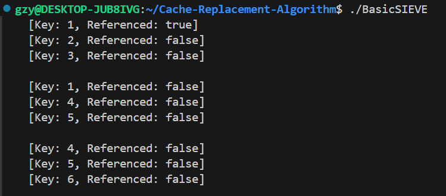

```C++
#include <iostream>
#include <list>
#include <unordered_map>

// 缓存项的结构体
struct CacheItem
{
    int key;
    int value;
    bool referenced;

    CacheItem(int k, int v) : key(k), value(v), referenced(false) {}
};

class BaiscSIEVE
{
private:
    int capacity_;
    std::list<CacheItem> cacheList_;
    std::unordered_map<int, std::list<CacheItem>::iterator> cacheMap_;

    void evict()
    {
        while (true)
        {
            auto it = cacheList_.begin();
            if (it->referenced)
            {
                it->referenced = false;
                // 将该项移动到链表尾部
                cacheList_.splice(cacheList_.end(), cacheList_, it);
            }
            else
            {
                // 如果找到false缓存项，则淘汰
                cacheMap_.erase(it->key);
                cacheList_.erase(it);
                break;
            }
        }
    }

public:
    BaiscSIEVE(int cap) : capacity_(cap) {}

    // 访问缓存
    bool get(int key)
    {
        // 检查缓存是否命中
        if (cacheMap_.find(key) != cacheMap_.end())
        {
            // 缓存命中：将引用位设置为 true
            auto it = cacheMap_[key];
            it->referenced = true;
            return true;
        }
        return false;
    }

    void put(int key, int value)
    {
        // 检查缓存是否已存在该键
        if (cacheMap_.find(key) != cacheMap_.end())
        {
            // 如果已存在，更新其值并设置引用位为 true
            auto it = cacheMap_[key];
            it->value = value;
            it->referenced = true;
        }
        else
        {
            // 缓存未命中
            // 如果缓存已满，则进行淘汰
            if (cacheList_.size() >= capacity_)
            {
                evict();
            }

            // 将新项添加到链表尾部
            cacheList_.emplace_back(key, value);
            cacheMap_[key] = std::prev(cacheList_.end());
        }
    }

    void display() const
    {
        if (cacheList_.empty())
        {
            std::cout << "  (Cache is empty)" << std::endl;
        }
        else
        {
            for (const auto &item : cacheList_)
            {
                std::cout << "  [Key: " << item.key << ", Referenced: " << (item.referenced ? "true" : "false") << "]" << std::endl;
            }
            std::cout << std::endl;
        }
    }
};

int main()
{
    BaiscSIEVE cache(3);
    cache.put(1, 10);
    cache.put(2, 20);
    cache.put(3, 30);

    cache.get(1);
    cache.display();

    cache.put(4, 40);
    cache.put(5, 50);
    cache.display();

    cache.put(6, 60);
    cache.display();
    return 0;
}
```

这个实现中SIEVE每次插入时，链表从头到尾扫描，即越靠近链表头的缓存项越久没有使用，SIEVE每次从头到尾扫描寻找第一个false缓存项淘汰。



