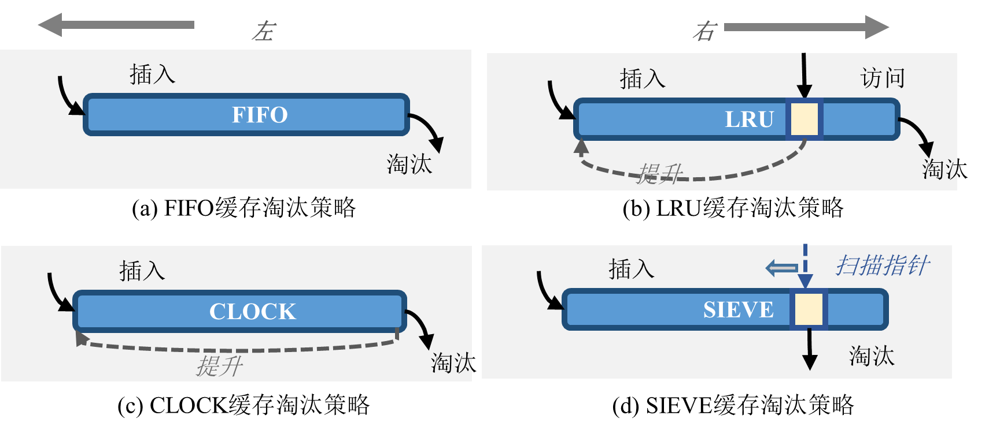

# 基于先进先出队列的无锁元数据缓存管理机制Mobius
## 高并发场景下元数据缓存的吞吐率问题
缓存性能挑战的三项重要指标：
1. 
$$
\text{缓存命中率} = \frac{\text{缓存命中次数}}{\text{总请求次数}} \times 100\%
$$
缓存命中率高说明有效减少了对后端存储的访问，提高命中率的关键在于使用先进的缓存淘汰策略。
2. 并发吞吐率：缓存每秒能够处理的请求数量
3. 缓存延迟：缓存系统处理每个请求所需要的时间
缓存延迟指标，尤其是尾延迟成为衡量缓存系统性能的重要因素。
## 缓存淘汰策略的分析和对比

FIFO：缓存项按照插入的顺序被逐出
LRU：缓存项正常插入逐出，被访问时调整位置，移至队列左侧
CLOCK：基于FIFO算法改进，每个缓存项关联一个访问标记，当缓存项命中时访问标记置1，从队列右侧选择最旧的缓存项进行处理。若访问标记为1，给予第二次机会，即访问标记被清除，并将该缓存项重新插入到队列左侧，视为新项。CLOCK算法会继续搜索，直到找到一个访问标记为0的旧缓存项淘汰。
SIEVE：基于CLOCK算法